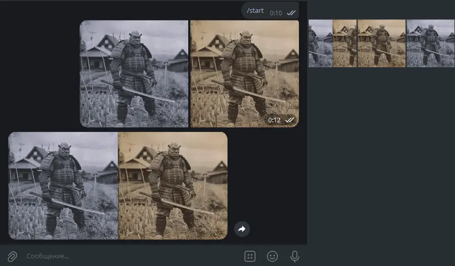

Telegram-бот, который объединяет два изображения в одно изображение. Бот работает с фотографиями, отправленными пользователем, и автоматически создает коллаж из двух последних полученных изображений.

 

    
    

 

## Работа
1. Пользователь отправляет боту два изображения по очереди
2. Бот сохраняет эти изображения
3. Когда получено второе изображение, бот:
   - Скачивает оба изображения с серверов Telegram
   - Создает новое изображение, где оба исходных изображения расположены горизонтально
   - Отправляет результат пользователю
   - Очищает очередь полученных изображений

## Технологии
- Python 3
- `python-telegram-bot`
- `Pillow`
- `requests`

## Возможные применения
**Создание сравнений "до/после"**:
   - Демонстрация изменений (ремонт, преображение)
   - Сравнение результатов косметических процедур

**Создание коллажей**:
   - Объединение двух связанных изображений
   - Сравнение альтернативных вариантов

**Образовательные цели**:
   - Сравнение исторических и современных видов местности
   - Демонстрация научных экспериментов
   - Показ изменений в природе
